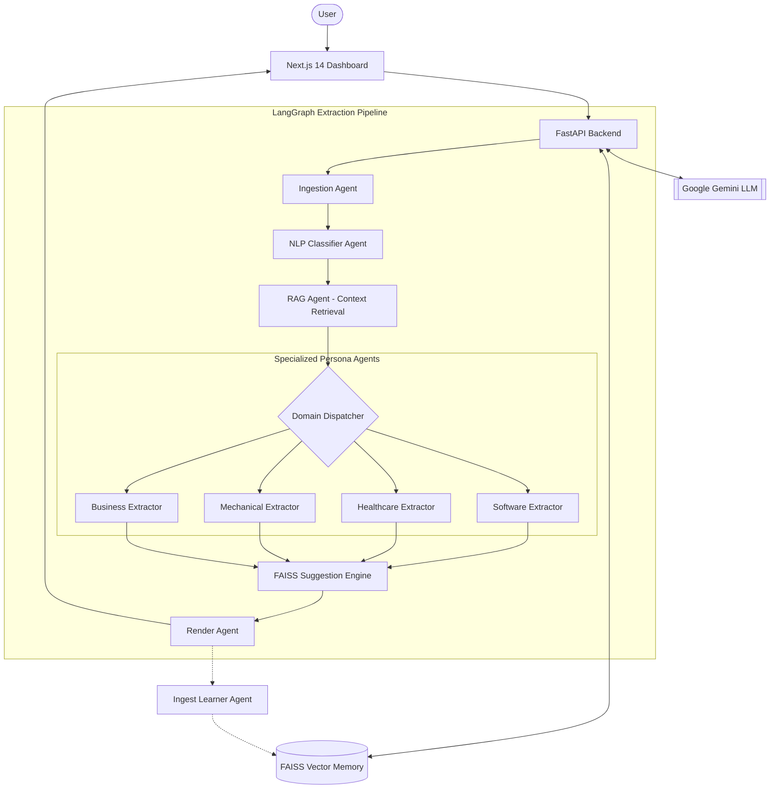

#BRDApex: AI-Powered BRD Extraction Dashboard 🚀

Code Apex is a production-grade Requirements Engineering platform that transforms unstructured corporate communications (emails, meeting transcripts, documents) into structured **Business Requirement Documents (BRD)** using a multi-agent AI pipeline.

## 🏗️ Project Architecture

Code Apex operates on a **LangGraph-driven Multi-Agent Pipeline**. Unlike traditional linear processing, each specialized agent autonomously processes a different part of the requirement lifecycle:



### Key Agents & Roles:
1.  **Ingestion Agent**: Collects and pre-processes raw text or uploaded documents (PDF, DOCX, VTT).
2.  **Classifier Agent**: Uses a trained **NLP Model** to distinguish between functional requirements, non-functional requirements, stakeholders, and "noise."
3.  **RAG Agent**: Queries a 200,000+ vector knowledge base (Enron/AMI corpus) for domain context.
4.  **Specialized Domain Agents**: Routes the data to persona-specific extractors for **Software, Healthcare, Mechanical, or Business** domains.
5.  **AI Suggestion Agent (FAISS)**: Uses **Vector Similarity Search (FAISS)** to compare your current draft against 20+ historical projects. It "predicts" and suggests requirements that might be missing based on similar past work.
6.  **Ingest Learner Agent**: Automatically indexes every finalized BRD back into the FAISS store, allowing the system to learn and improve with every session.
7.  **Render Agent**: Normalizes the final state for real-time streaming to the dashboard.

### Tech Stack:
- **Frontend**: Next.js 14 (App Router), TailwindCSS, Framer Motion, Lucide icons.
- **Backend**: FastAPI, LangGraph, FAISS, SentenceTransformers (all-MiniLM-L6-v2).
- **Models**: Google Gemini 1.5 (with multi-key fallback rotation).

## 🚀 Getting Started

### Prerequisites:
- Python 3.10+
- Node.js 18+
- Google Gemini API Key(s)

### 1. Backend Setup
```bash
cd backend
python -m venv venv
# Windows:
.\venv\Scripts\activate
# Linux/macOS:
source venv/bin/activate

pip install -r requirements.txt
```

Create a `.env` file in `backend/`:
```env
# Multi-API Key Support (will fallback if one fails)
GOOGLE_API_KEY_1=your_api_key_here
GOOGLE_API_KEY_2=your_second_key_here
```

Run the backend:
```bash
uvicorn main:app --port 8000 --reload
```

### 2. Frontend Setup
```bash
cd frontend
npm install
npm run dev
```
